# Publicando tu aplicación en Google Play (PlayStore )

Una vez que hemos terminado de construir una aplicación siempre queda
la inquietud de cómo **distribuirla al mundo**. Los pasos desde la primera versión de la tienda
no han cambiado mucho. Así que vamos por cada uno de ellos.


## Creando tu cuenta de desarrollador

Publicar en la tienda requiere que tengas una licencia cómo desarrollador, la cuál
se crea desde la [Google Play Developer Console ](https://play.google.com/apps/publish/), accediendo con tu
cuenta de gmail.

Algo importante a tener en cuenta es que está tiene un costo de $25 dólares, pero no te preocupes,
es un solo pago y no tienes limite de número de aplicaciones a publicar. Igualmente puedes invitar a otros
desarrolladores a publicar con la misma cuenta.


Para terminar el registro, solo completa el formulario de pago y los datos de tu cuenta. Esto último hace parte de la información con las que tus usuarios pueden encontrarte o contactarte, por lo cual recomiendo
que no ignores ninguno de los campos. Igualmente esta información puede ser modificada más adelante en caso de ser necesario.


Y con estó, ya está lista tu cuenta para publicar cualquier aplicación.

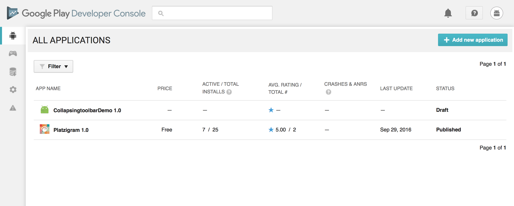

## Preparando tu aplicación para Producción

### Actualiza tu Entorno y librerías

Vamos a regresar a tu proyecto y quizás este paso parezca obvio, pero te recomiedo que siempre lo hagas: Actualiza primero Android Studio y todas las librerías :

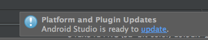

Tener la última versión del IDE y de las librerías nos asegurán tener los parches de seguridad más reciente y la compatbilidad para más dispositivos.

### Minifica tu aplicación desde Graddle

Minificar tu aplicación permite que pese menos ademas que tenga un grado más de encriptación que la protege en caso de que alguien quiera hacer ingeniera inversa de la misma.  

Hacerlo es muy sencillo, buscamos el archivo **build.grade** que esta a nivel de la aplicación.


En este archivo, en la parte de **buildTypes**, vamos a modificar **minifyEnabled** y agregar **shrinkResources**


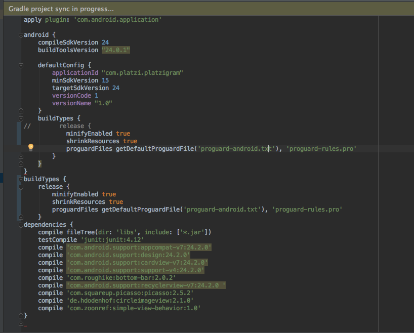

#### minifyEnabled

```
minifyEnabled true
```

Poner en **true** esta configuración hace la minificación de nuestro código Java

#### shrinkResources


```
shrinkResources true
```

Poner en **true** esta configuración hace la minificación de nuestros recursos gráficos, osea, la carpeta /res

Al agregar esto Graddle pedirá volver a construir el proyecto, hazlo sin problema


### Firmando la aplicación y generando el APK

Lo que subimos a la tienda de aplicaciones en un APK, pero no podemos usar el que se instala por defecto
en nuestro dispositivo de prueba, necesitamos **firmarlo**, para ello vamos a Build --> Generate Signed APK

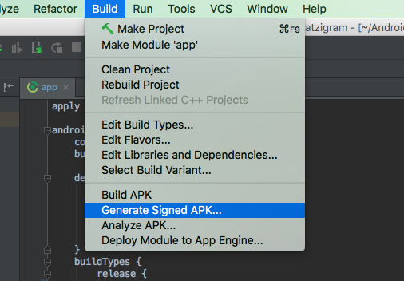

Seleccionamos el módulo que deseamos firmar, aquí por ejemplo se pueden desplegar las opciones de Android Wear, Android Auto u otros __builds__ que podamos tener. En el mayoría de los casos, solo tendremos
para telefono/tablet, así que seleccioamos **app**.

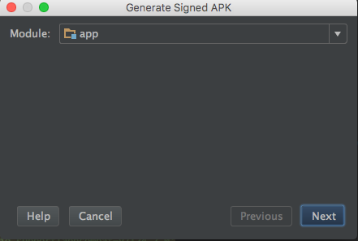

Nos va a pedir genarar una llave ( **create new**) o elegir una ya existente (**Choose Existing**). Si
es la primera vez que subes una aplicación creamos una nueva, si solo es una actualización, aquí es donde usamos alguna que hayamos creado.

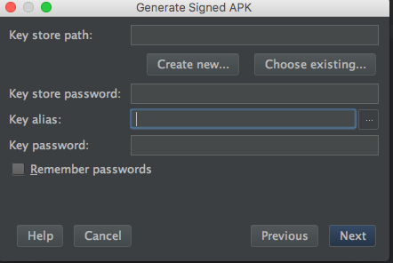

Al crear la llave, no olvides ninguno de los datos requeridos, ya que **si los perdemos, no podremos acutalizar la aplicación y tendríamos que subirla de nuevo**


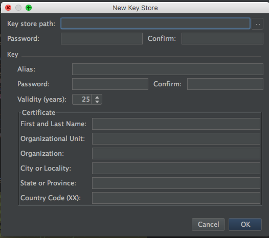

Alias y Password siempre van a ser requeridos cuando subas una nueva versión de la aplicación, entonces, si
alguien más de tu equipo esta trabajando contigo, comparte ese dato. Lo demas es muy parecido a cuando creamos nuetras cuenta.


Por cierto, Key Store path es la ruta donde se va a guardar el certificado, crea una copia de ese archivo en algun lugar como respaldo. Al terminar de crear tu llave, se pedirá que confirmes de nuevo el alias y el Password.  


Ya teniendo seleccionado el certificado, podemos elegir un destino donde se va a crear el APK. Esto es totalmente a elección tuya.

**Con esto, tu APK esta estará exitosamente creado y listo para subir al PlayStore**


#### Posibles errores

Quizás cuando estás creando tu app, tendrás algunos errores que no te permitirán avanzar en al construcción del APK. El más común de ellos tiene que ver con una opción del ProGuard cómo:

*there where "n" unresolved references to classes or interfaces*, tal cómo en la siguiente imagen:


Solucionarlo es muy fácil y sucede muy frecuente en librerías de terceros. Busca en el repo o en la documentación de la misma el apartdo que diga *ProGuard*

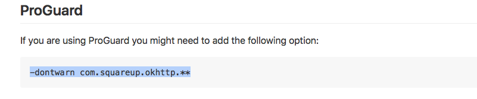

Agregamos dicha linea en el archivo *proguard-rules.pro*. Si tomamos el ejemplo de PlatziGram, tenemos 2 lbrerías que necesitan esta regla. Las agregamos y todo listo.

Si no llegas a encontrar la configuración en la documentación de la librería, puedes intentar usando:

```
-dontwarn nombre.del.paquete.**

```


### Subiendo nuestro APK


### APK ( Obligatorio )

Ya teniendo el APK firmado, vamos a volver a la [Google Play Developer Console](https://play.google.com/apps/publish/), y seleccionamos +Add new application


Seleccionamos el nombre que queremos para la aplicación y podemos de inmediato buscar nuestro APK:


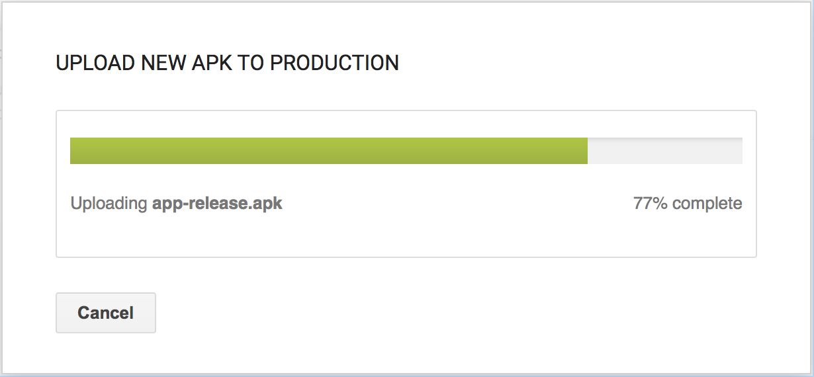

Vamos a tener un preview de todos los dispositivos que es compatible la aplicación

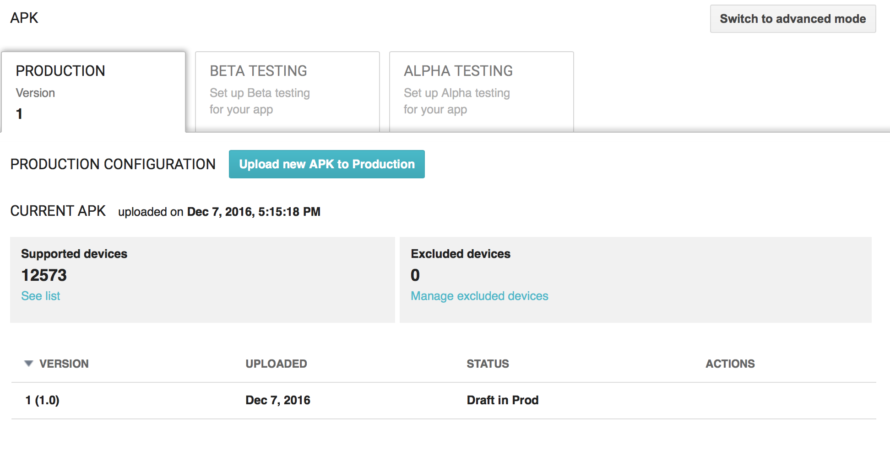

De hecho, podemos omitir algunos en particular


Los siguientes pasos son muy importantes para detallar tu aplicación, por lo tanto, te recomiendo
ir guardando el borrador cada vez que avances.

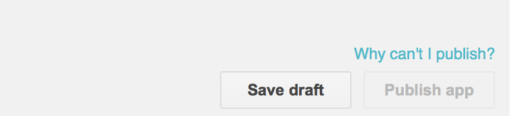

### Store Listing ( Obligatorio )

Store listing es donde nosotros describimos nuestra aplicación y un preview de como se ve en los dispositivos.

 Los datos son muy intuitivos de llenar, y necesitaras obligatoriamente el icono de la aplicación, una imagen de "cover" o "Feature" y al menos un screenshot. Los tamaños de dichas imagenes podrían cambiar en el futuro, por eso es importante que mires las especificaciones de las mismas en el formulario:

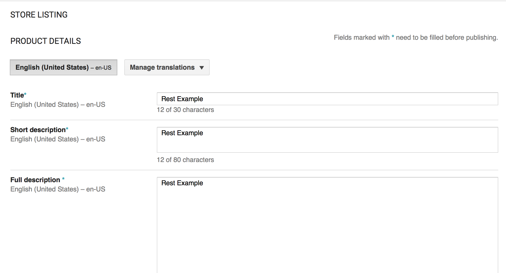
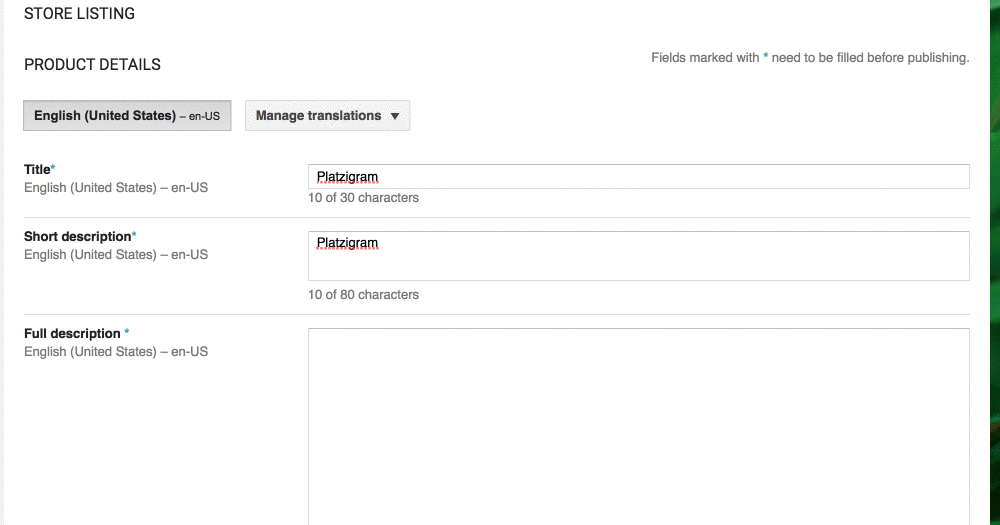

Por ejemplo, para instagram, cremos lo siguiente:

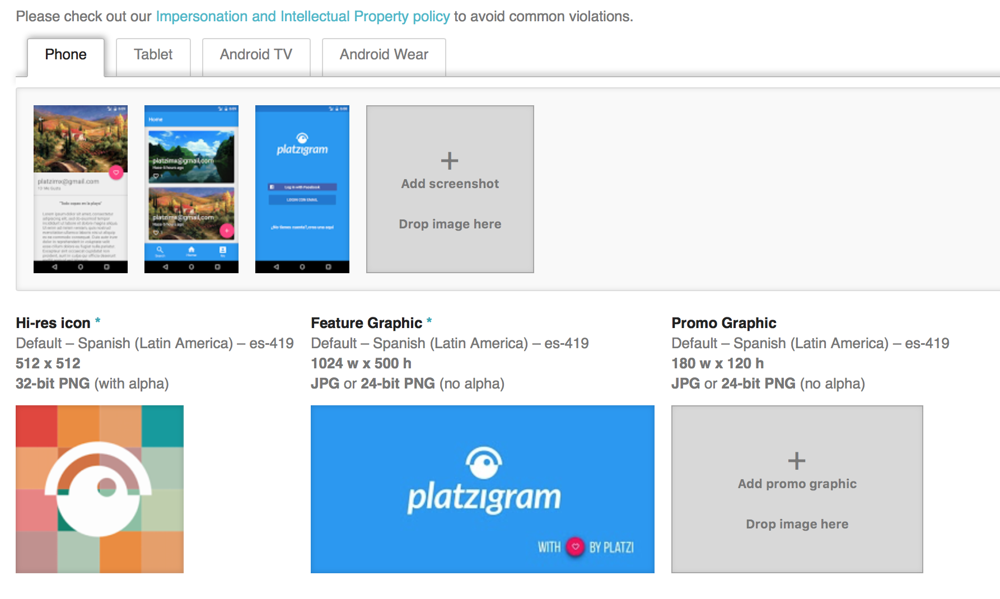

### Content Raiting ( Obligatorio )

Aquí es donde configuramos si la aplicación es apta para todo o cierto público. Se obtiene una calificación de
acuerdo a lo que respondamos, por ejemplo, si tiene contenido violento o sexual.


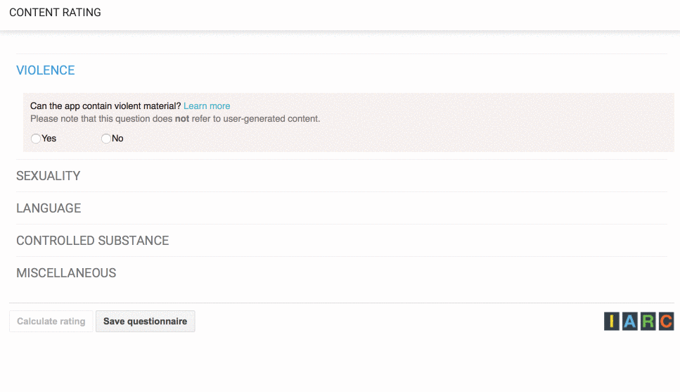

### Pricing & Distribution ( Obligatorio )

Aquí podemos seleccionar en que paises estará disponible la aplicación, además , si es una aplicación gratuita o de pago.

Para aplicaciones de pago, puedes consultar el siguiente enlace para saber más que de cómo aplica en tu pais, ya que esto cambia de acuerdo a ello:

https://support.google.com/googleplay/android-developer/#topic=3452890


### In-app Products ( Opcional )

Hay aplicaciones donde pagas para liberar cierto contenido, justo en este apartado en donde se sube el APK con el buid de la aplicación completa.

### Services & APIs ( Opcional )

Aquí es donde se configuran algunos Servicios y APIS de Terceros, como FIREBASE CLOUD MESSAGING (FCM) o App Indexing

### Tu apicación está lista


Una vez que tengas todos los pasos obligatorios mencioandos anteriormente, podrás publicar tu aplicación. De no ser posible, puedes seleccionar donde dice: Why can't I Publish? y Google Play Console te dirá que omitiste.


En unas horas o dias, tu aplciación estara lista en la tienda, recibirars la notificación por correo.


No olvides dejar en los comentarios el enlace si ya publicaste tu aplicación o si tienes alguna duda.  
